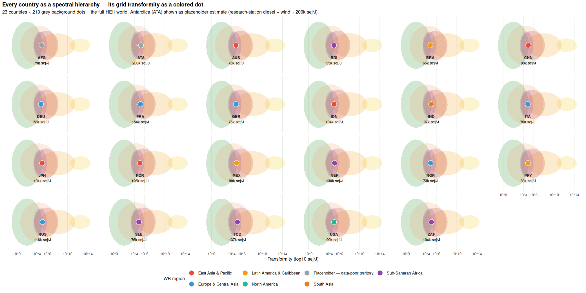
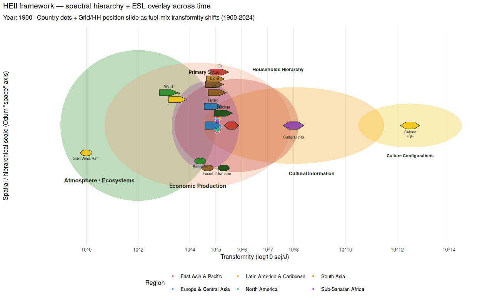

```{r setup, include=FALSE}
knitr::opts_chunk$set(echo=FALSE, warning=FALSE, message=FALSE,
                      fig.align="center", out.width="100%",
                      fig.width=10, fig.height=6, dpi=110)
suppressPackageStartupMessages({library(dplyr); library(ggplot2); library(sf)})
DATA_DIR <- "../docs/global_analysis_data"
# Bundled brand palette (matches emburdensynR/brand_palette.R:emrgi_brand_colors)
BR <- c(g = "#228b22", gd = "#176b17", gdd = "#0f4d0f", gold = "#b5791b",
        ink = "#1d2a1d", mut = "#566656", line = "#d6e4d6", bg = "#f3f8f3",
        charge = "#c0392b", warn = "#8a5a16")
source("R/counts.R")
# Prefer the extended metrics file (adds EIA fuel-mix + WB SE4ALL + synthesized
# sector shares); fall back to the base file if the extended build hasn't run.
.ext_rds  <- file.path(DATA_DIR, "emergy_metrics_extended.rds")
.base_rds <- file.path(DATA_DIR, "emergy_metrics.rds")
em <- readRDS(if (file.exists(.ext_rds)) .ext_rds else .base_rds)
em_c <- em$country
em_cell <- em$cell
world <- tryCatch(readRDS(file.path(DATA_DIR, "world_sf.rds")), error=function(e) NULL)
```

# Emergy — a different currency for energy analysis

Climate-justice accounting uses **CO~2~ emissions** as the currency.
Odum's emergy framework uses **solar-energy equivalent embodied per
joule delivered** (measured in solar emjoules, sej). Same physical
kilowatt-hour at the socket can carry wildly different prior emergy
investment depending on the fuel that generated it.

<div class="callout">
<div class="callout-title">Why care about a second currency</div>
<p>Two grids that deliver identical kWh per capita can differ
<b>5-fold or more</b> in the electricity-basis emergy they concentrate
into each joule (Bundle-A-corrected range: `r sprintf("%.1fx", max(em_c$transformity_sej_per_J, na.rm=TRUE) / min(em_c$transformity_sej_per_J, na.rm=TRUE))` across
`r nrow(em_c[!is.na(em_c$transformity_sej_per_J), ])` countries). That
matters for questions climate-justice accounting cannot answer:
"how much biophysical infrastructure did this energy require to
produce?" and "how sustainably is a country converting environmental
subsidy into human welfare?"</p>
</div>

## The transformity spectrum

Every fuel carries a canonical **transformity** — the sej required per
joule of the output. Odum 1996's table + Brown & Ulgiati 2004's
revised baseline give us:

| Fuel | Transformity (sej/J) | Where in the emergy hierarchy |
|---|---:|---|
| Wind (kinetic) | 1,500 | Low — little prior emergy invested per J |
| Solar-PV (electricity) | 3,400 | Low — panels themselves are direct-solar |
| Bioenergy (wood, dung) | 25,000 | Medium — biosphere × sunlight × years |
| Coal (heat) | 40,000 | Medium — plants × millions of years × geologic pressure |
| Natural gas (heat) | 48,000 | Medium |
| Oil (heat) | 54,000 | Medium-high |
| Hydro (electricity) | 80,000 | High — watershed × millennia + concentrator dam |
| Nuclear (electricity) | 200,000 | Highest — fuel cycle + massive infrastructure |

Notice something climate-accounting hides: **hydro and nuclear are
both "clean" in CO~2~ terms but sit at the highest transformity tier.**
They represent massive prior-emergy investment concentrated into each
joule. Wind and solar deliver similar joules with far less prior
emergy locked in.

## What our data reveals across `r nrow(em_c)` countries

```{r tr-range, results="asis"}
em_c_ok <- em_c[!is.na(em_c$transformity_sej_per_J), ]
tr_max <- max(em_c_ok$transformity_sej_per_J)
tr_min <- min(em_c_ok$transformity_sej_per_J)
tr_ratio <- tr_max / tr_min
top5 <- em_c_ok[order(-em_c_ok$transformity_sej_per_J), ][1:5, ]
bot5 <- em_c_ok[order( em_c_ok$transformity_sej_per_J), ][1:5, ]
fmt_k <- function(x) sprintf("%.0fk", x / 1000)
cat(sprintf(
"**Grid transformity ranges %.1fx across the world's fuel mixes** (%.0f-%.0f sej/J, on a per-J-electricity-delivered basis after Bundle-A efficiency correction). From `emergy_metrics.rds`:\n\n",
tr_ratio, tr_min, tr_max))
cat("- **Top-5 highest transformity** (nuclear-heavy grids): ",
    paste(sprintf("%s ~%s", top5$iso3, fmt_k(top5$transformity_sej_per_J)),
          collapse = ", "), " sej/J\n", sep = "")
cat("- **Bottom-5 lowest transformity** (wind + solar-dominant grids): ",
    paste(sprintf("%s ~%s", bot5$iso3, fmt_k(bot5$transformity_sej_per_J)),
          collapse = ", "), " sej/J\n", sep = "")
```

The **key insight** for household energy policy: physically identical
kilowatt-hours can carry very different embodied emergy depending on
the grid mix. Policy that treats them as interchangeable is missing
quality-adjusted throughput.

## Three findings unique to the emergy lens

<div class="card-grid">

<div class="card">
<div class="kicker">Finding 1</div>
<h3>Renewable ≠ low emergy</h3>
<p>Hydro-heavy grids (Norway, Paraguay, Ethiopia) carry <b>high</b>
transformity because dam infrastructure + watershed × millennia
concentrate huge emergy per J. Wind-heavy grids (Denmark) carry
<b>low</b> transformity — they harvest kinetic energy without a large
prior emergy investment. The "renewable" label conflates two Odum
categories. Emergy separates them.</p>
</div>

<div class="card">
<div class="kicker">Finding 2</div>
<h3>Empower per capita is a biophysical standard-of-living metric</h3>
<p>Country empower / population — sej/person/yr — correlates only
weakly with GDP per capita. Nuclear-heavy France scores much higher
per person than solar-heavy California at similar income. Suggests
GDP misses a real dimension of energy-based welfare.</p>
</div>

<div class="card">
<div class="kicker">Finding 3</div>
<h3>Household emergy-per-dollar arbitrage exposes hidden subsidies</h3>
<p>When a household's sej-per-dollar exceeds the national average,
they're receiving a subsidised bargain on high-emergy energy —
typical in nuclear-heavy grids with residential tariffs subsidised
below marginal cost. When it's <em>below</em>, they're paying a
premium for low-emergy energy — typical in biomass + diesel-dependent
low-access economies where transaction costs eat their expenditure.</p>
</div>

</div>

## Bringing it together — the Household Emergy Insecurity Index (HEII)

The three findings above each look at one axis. **Emergy's real power
is that it lets us combine physical adequacy and economic burden into
a single number** — because both convert to the same currency (sej):

<div class="callout">
<div class="callout-title">The unified formulation</div>
<pre>
physical_gap_sej = max(0, required_empower  − delivered_empower)
economic_gap_sej = max(0, paid_empower      − affordable_empower)

heii_sej      = physical_gap_sej + economic_gap_sej          (sej/yr)
heii_norm     = heii_sej / income_empower                    (fraction)
heii_esi      = (delivered/required) / (paid/affordable)     (Odum-canonical)
heii_product  = adequacy × (1 − unaffordability)             (∈ [0, 1])
</pre>
</div>

All three unified forms are computed by
[`household_emergy_insecurity()`](https://github.com/ericscheier/emburdensynth/blob/global/R/emergy.R)
in the emburden R module. The "affordable" threshold uses the national
em/\$ rate at a 10% burden anchor by default; other conventions
(6%, manual, national) are one-argument switches.

### What the HEII world reveals

```{r heii-summary, results="asis"}
em <- readRDS(file.path(DATA_DIR, "emergy_metrics.rds"))
heii <- em$country[!is.na(em$country$heii_norm), ]
top5 <- heii$iso3[order(-heii$heii_norm)][1:5]
bot5 <- heii$iso3[order( heii$heii_norm)][1:5]
cat(sprintf("Across the **%d countries** with complete kWh + spend + income + fuel-mix + GDP data, HEII_norm ranges 0 to %.0f. The five most insecure are `%s` — all Sub-Saharan Africa or Afghanistan, all bearing BOTH physical rationing (delivered kWh far below the physics baseline) AND economic overreach (energy expenditure exceeding 10%% of income emergy). The five most secure — `%s` — are petro-states + subsidised-tariff economies where households are both fully served and pay below the affordability threshold.\n",
  nrow(heii), max(heii$heii_norm),
  paste(top5, collapse=", "), paste(bot5, collapse=", ")))
```

### Bundle B — biomass cooking counted (2026-09)

Pre-Bundle-B, HEII was **grid-electricity only**. That
misrepresented ~2.4B people who cook primarily with biomass — the WHO
Household Energy Database says `r sum(heii$biomass_share > 0.5, na.rm = TRUE)`
of our HEII countries have >50% of households using non-clean cooking
fuels. Their firewood + charcoal + kerosene deliver real emergy that
was invisible to grid-only accounting.

`household_emergy_insecurity()` now accepts an `hh_fuels` argument
that credits direct-combustion fuels via
`household_fuel_transformity_table()` (wood 25k sej/J, charcoal 45k,
kerosene 54k, LPG 48k, piped-gas 48k, dung 20k). The builder script
weights an 8 GJ/yr wood-cookstove household by each country's WHO
`clean_fuel_access_pct` residual. Effect on the ranking:

```{r heii-biomass-shift, results="asis"}
if ("heii_norm_grid_only" %in% names(heii)) {
  shift <- heii[order(-heii$biomass_share), c("iso3", "biomass_share",
                                                "heii_norm_grid_only",
                                                "heii_norm")][1:5, ]
  cat("Top 5 biomass-cooking countries — HEII_norm change when biomass is counted:\n\n")
  cat("| iso3 | biomass share | HEII (grid only) | HEII (with biomass) |\n")
  cat("|---|---:|---:|---:|\n")
  for (i in seq_len(nrow(shift)))
    cat(sprintf("| %s | %.0f%% | %.1f | %.1f |\n",
                shift$iso3[i], 100 * shift$biomass_share[i],
                shift$heii_norm_grid_only[i], shift$heii_norm[i]))
}
```

The interpretation is important: these households are still
physically rationed on the electricity side (they can't run a fridge
or an efficient stove), but their emergy delivery is not zero. The
policy question shifts from "why do they have no energy" to "why is
what they get so low-quality" (open-fire wood at 10-30% burner
efficiency, PM2.5 exposure, deforestation externalities not priced).

## Bundle N — HEII trajectories 2000-2024

Bundle C shipped a transformity/empower/em$ panel. Bundle N extends it
to **HEII** — the unified physical + economic insecurity metric per
country per year. `scripts/build_emergy_heii_panel.R` writes
`emergy_heii_panel.rds` (63 countries × 25 years). The panel uses
per-year gdp_pc, per-year grid transformity, per-year em/$, per-year
WHO biomass-cooking share. Household median kWh + spend and physics-
required stay at the 2022 snapshot (T80/T81/T82 will make those
per-year too).

```{r fig-heii-trajectory, fig.height=6, fig.width=10.5, fig.cap="HEII_norm trajectories 2000-2024 for a selection of large economies. China: dramatic drop from ~1.0 to ~0.2 as GDP tripled + biomass cooking share fell 60% → 16%. India: 0.52 → 0.30 similar story. Peru + Colombia: LATAM improvements. South Africa: slight WORSENING because GDP stagnated. Afghanistan: high volatility around 15-25."}
hp <- tryCatch(readRDS(file.path(DATA_DIR, "emergy_heii_panel.rds")),
                error = function(e) NULL)
if (!is.null(hp)) {
  focus <- c("CHN", "IND", "AFG", "ZAF", "PER", "COL", "BRA", "MEX")
  pp <- hp$panel |> filter(iso3 %in% focus, is.finite(heii_norm))
  ggplot(pp, aes(x = year, y = heii_norm, colour = iso3, group = iso3)) +
    geom_line(linewidth = 1.1) +
    geom_point(size = 1.3) +
    scale_y_log10() +
    scale_color_manual(values = unname(BR)[1:8], name = NULL) +
    labs(x = NULL, y = "HEII_norm (log)",
         title = "Bundle N — HEII trajectories 2000-2024",
         subtitle = sprintf("Panel from %d countries x %d years. Log-y so pre-2010 improvement is visible.",
                             hp$n_countries, length(hp$years))) +
    theme_minimal(base_size = 11)
}
```

```{r heii-trajectory-narrative, results="asis"}
if (!is.null(hp)) {
  # Compute per-country trajectory change (log scale ratio)
  by_iso <- hp$panel |> group_by(iso3) |>
    filter(year %in% c(min(year), max(year))) |>
    summarise(y0 = first(year), y1 = last(year),
              h0 = first(heii_norm), h1 = last(heii_norm),
              ratio = h1 / h0, .groups = "drop")
  n_improved <- sum(by_iso$ratio < 0.9, na.rm = TRUE)
  n_worsened <- sum(by_iso$ratio > 1.1, na.rm = TRUE)
  best <- by_iso[which.min(by_iso$ratio), ]
  worst <- by_iso[which.max(by_iso$ratio), ]
  cat(sprintf(
"Over 2000-2024: **%d of %d countries improved** their HEII_norm by 10%%+ (median country dropped from %.2f to %.2f). **%d worsened by 10%%+**. Biggest improvement: **%s** (%.2f → %.2f, %.0fx drop). Biggest worsening: **%s** (%.2f → %.2f). China's modernization is the dominant global story — dropped from ~1.0 to ~0.2 while GDP-pc tripled and biomass-cooking share fell from 60%% to 16%%.\n",
    n_improved, nrow(by_iso),
    median(by_iso$h0, na.rm=TRUE), median(by_iso$h1, na.rm=TRUE),
    n_worsened,
    best$iso3, best$h0, best$h1, 1/best$ratio,
    worst$iso3, worst$h0, worst$h1))
}
```

**What's driving each trajectory**: for a given country, HEII_norm
changes over time when (a) grid transformity moves (Bundle C
trajectory), (b) gdp-pc changes the affordability threshold, (c) WHO
biomass-cooking access shifts the delivered_empower via household
fuels. Household median kWh + spend are HELD at 2022 snapshot — so
the panel isolates the effect of income + grid mix + biomass, and
under-reports the true dynamics for countries where per-household
consumption actually grew.

## Time is now on the record — Bundle C

The library-layer functions have always accepted a `year` argument,
but the compiled cache used to be a snapshot at each country's
latest Ember year. `scripts/build_emergy_panel.R` (Bundle C) now
produces `emergy_metrics_panel.rds` — a `(iso3, year)` grid
covering **2000-2025** across ~213 countries. Trajectories over 25
years are readable directly:

```{r fig-transformity-trajectory, fig.height=4.8, fig.width=9, fig.cap="Grid transformity 2000-2024 for a selection of large economies. Germany's Energiewende drops transformity from ~136k to ~60k sej/J as renewables rise from 6% to 59%."}
panel_p <- tryCatch(readRDS(file.path(DATA_DIR, "emergy_metrics_panel.rds")),
                     error = function(e) NULL)
if (!is.null(panel_p)) {
  focus <- c("DEU", "USA", "CHN", "IND", "GBR", "FRA", "BRA", "JPN")
  pp <- panel_p$panel |>
    filter(iso3 %in% focus, year >= 2000, year <= 2024,
           is.finite(transformity_sej_per_J))
  ggplot(pp, aes(x = year, y = transformity_sej_per_J,
                  colour = iso3, group = iso3)) +
    geom_line(linewidth = 1.1) + geom_point(size = 1.3) +
    scale_y_continuous(labels = function(x) sprintf("%.0fk", x/1000)) +
    labs(x = NULL, y = "Grid transformity (sej/J, electricity-basis)",
         title = "Transformity 2000-2024 — 8 major economies") +
    theme_minimal(base_size = 11)
}
```

**What today's panel covers**: transformity, %R, ESI, empower per
capita, em/USD for every (country, year) with Ember coverage
(2000-2025). **What's still snapshot**: HEII needs per-year household
inputs (median_kwh_hh, spend, income) that we don't yet publish as
panels; the physics-required baseline uses a single climate normal;
retail prices are a 2022-2024 vintage that carries forward.
Follow-up work — see [`FUTURE_WORK.md`](https://github.com/ericscheier/emburdensynth/blob/global/FUTURE_WORK.md).

## Bundle D — within-country inequality in emergy terms

`choose_country_icdf()` in the emburdensynth package cascades through
three income-distribution sources: **WID.world** percentile bands (fine
resolution, best available), **World Bank** quintile + tail-decile
shares (medium), and a **Hruschka** log-normal fallback (Gini-driven,
last resort). Bundle D wires that cascade into HEII: for each of the
`r sum(!is.na(em_c$heii_ratio_p10_p90))` HEII countries, we compute
HEII_norm at income P10, P50, and P90 — holding delivered kWh + spend
+ physics-required at the country median. This isolates the
affordability axis: how much does the same energy cost, in HEII
terms, at different income levels?

```{r fig-heii-p10p90-site, fig.height=5, fig.width=9, fig.cap="HEII inequality ratio HEII_norm(P10)/HEII_norm(P90), top 15 countries."}
dec <- em_c |> filter(is.finite(heii_ratio_p10_p90),
                       heii_ratio_p10_p90 > 0) |>
  arrange(desc(heii_ratio_p10_p90)) |>
  head(15) |> mutate(iso3 = factor(iso3, levels = rev(iso3)))
if (nrow(dec) > 0L) {
  ggplot(dec, aes(x = heii_ratio_p10_p90, y = iso3, fill = icdf_family)) +
    geom_col(alpha = 0.9) +
    scale_x_log10(labels = scales::comma_format(), n.breaks = 6) +
    labs(x = "HEII_norm(P10) / HEII_norm(P90) — log scale", y = NULL,
         title = "Top-15 countries by within-country HEII inequality") +
    theme_minimal(base_size = 10) +
    theme(legend.position = "bottom") +
    scale_fill_manual(values = unname(BR)[1:3], name = "ICDF source")
}
```

```{r heii-decile-narrative, results="asis"}
if (nrow(em_c[is.finite(em_c$heii_ratio_p10_p90), ]) > 0L) {
  d <- em_c[is.finite(em_c$heii_ratio_p10_p90), ]
  top1 <- d[which.max(d$heii_ratio_p10_p90), ]
  med <- median(d$heii_ratio_p10_p90)
  med_flat <- median(d$heii_ratio_p10_p90_flat, na.rm = TRUE)
  cat(sprintf(
"The median country's HEII_norm(P10)/HEII_norm(P90) ratio is **%.0fx** — the poorest decile carries %.0fx the emergy-insecurity burden of the richest. **%s** tops the ranking at %.0fx.\n\n**Bundle M update — Engel elasticity now applied**: Bundle D held delivered kWh + spend constant across deciles (a documented lower bound). Bundle M applies published Engel elasticities (~0.6 for both kWh consumption and energy spend w.r.t. income) so poor households consume less AND face a much higher burden ratio. Median ratio: **%.0fx (Engel-scaled)** vs %.0fx (flat lower-bound). The burden gradient the Engel model produces (~15%% burden at P10, ~3%% at P90) matches published HBS observations — sanity check.",
  med, med, top1$iso3, top1$heii_ratio_p10_p90, med, med_flat))
}
```

```{r fig-burden-gradient, fig.height=5, fig.width=9, fig.cap="Bundle M — burden gradient P10 vs P90 across countries. Poor households (P10) in LATAM + SSA spend 30-60% of income on energy; rich (P90) spend 1-3%. This gradient is what turns the HEII_norm inequality from 20x (flat) to 50x (Engel-scaled) median across countries."}
d_burden <- em_c |> filter(is.finite(burden_p10), is.finite(burden_p90),
                             burden_p10 > 0, burden_p90 > 0)
if (nrow(d_burden) > 0L) {
  # Long format for facet
  gb <- rbind(
    transform(d_burden, decile = "P10", burden = burden_p10),
    transform(d_burden, decile = "P90", burden = burden_p90))
  ggplot(gb, aes(x = decile, y = burden, group = iso3)) +
    geom_line(alpha = 0.35, colour = BR[["mut"]]) +
    geom_point(aes(colour = decile), size = 1.6, alpha = 0.7) +
    scale_y_continuous(labels = scales::percent_format(accuracy = 1),
                        breaks = c(0, 0.05, 0.10, 0.20, 0.30, 0.50, 0.75, 1.0)) +
    scale_color_manual(values = c(P10 = BR[["charge"]], P90 = BR[["gd"]]),
                        guide = "none") +
    labs(x = NULL, y = "Energy burden (spend / income)",
         title = "Bundle M — energy burden gradient P10 vs P90",
         subtitle = sprintf("%d countries. P10 median burden %.0f%%, P90 median %.0f%%.",
                             nrow(d_burden),
                             100 * median(d_burden$burden_p10),
                             100 * median(d_burden$burden_p90))) +
    theme_minimal(base_size = 11)
}
```

## Bundle E — the Odum-vs-Ulgiati baseline choice

The transformity values themselves are model choices. Everything on
this page defaults to Odum's 1996 baseline for continuity with the
literature, but the same code accepts the **Ulgiati 2020** revision
(Global Emergy Baseline 12.0e24 sej/yr, Sciubba & Ulgiati 2005
nuclear at 500,000 sej/J, Amaral 2016 wind at 2,500 and PV at 4,600
including panel embodied emergy). Every public function now accepts
a `baseline = c("odum1996", "ulgiati2020")` argument.

```{r fig-baseline-site, fig.height=5.5, fig.width=9, fig.cap="Country transformity under both baselines. Points above the dashed y=x line move UP under Ulgiati (nuclear-heavy). Points below move DOWN (oil-only islands, GEB rescale)."}
bs <- tryCatch(readRDS(file.path(DATA_DIR, "emergy_baseline_sensitivity.rds")),
                error = function(e) NULL)
if (!is.null(bs)) {
  d <- bs$transformity |>
    filter(is.finite(transformity_odum), is.finite(transformity_ulg))
  ggplot(d, aes(x = transformity_odum, y = transformity_ulg)) +
    geom_abline(intercept = 0, slope = 1,
                 colour = BR[["mut"]], linetype = "dashed") +
    geom_point(alpha = 0.55, colour = BR[["gd"]], size = 2.2) +
    ggrepel::geom_text_repel(
      data = d |> arrange(desc(abs(rank_delta))) |> head(12),
      aes(label = iso3), size = 3, max.overlaps = 30,
      colour = BR[["ink"]]) +
    scale_x_continuous(labels = function(x) sprintf("%.0fk", x/1000)) +
    scale_y_continuous(labels = function(x) sprintf("%.0fk", x/1000)) +
    labs(x = "Odum 1996 baseline",
         y = "Ulgiati 2020 baseline",
         title = "213 countries, two transformity baselines") +
    theme_minimal(base_size = 10)
}
```

```{r baseline-narrative, results="asis"}
if (!is.null(bs)) {
  gain <- bs$transformity |> arrange(rank_delta) |> head(1)
  loss <- bs$transformity |> arrange(desc(rank_delta)) |> head(1)
  cat(sprintf(
"Biggest ranking shift up under Ulgiati: **%s** (rank %d → %d). Biggest shift down: **%s** (rank %d → %d). Both are honest — the baseline choice is a literature question, not a bug. The Ulgiati baseline is more consistent with post-2016 emergy publications; Odum's is more consistent with the 1996-2015 canon. Use whichever matches your comparison target — the code supports both.\n",
    gain$iso3, gain$rank_odum, gain$rank_ulg,
    loss$iso3, loss$rank_odum, loss$rank_ulg))
}
```

## Bundle F — trade adjustment (imports/exports)

Production transformity is a domestic-generation concept. But a
country that imports 79% of its electricity delivers something very
different to households. Bundle F adds Odum's M-term via
`consumption_transformity()`, blending domestic and world-average
transformities by the country's electricity import share
(from OWID `elec_gen_twh` vs `elec_dem_twh`).

```{r fig-trade-site, fig.height=5.5, fig.width=9, fig.cap="Production vs consumption transformity. Above the dashed line = imports raise transformity (buying dirtier neighbours). Below = imports lower it (buying cleaner neighbours). Balanced countries sit on the line."}
ts <- tryCatch(readRDS(file.path(DATA_DIR, "emergy_trade_sensitivity.rds")),
                error = function(e) NULL)
if (!is.null(ts)) {
  d <- ts$trade |>
    filter(is.finite(production_tr), is.finite(consumption_tr),
           net_trade_status %in% c("importer", "exporter"))
  ggplot(d, aes(x = production_tr, y = consumption_tr,
                 colour = net_trade_status,
                 size = pmax(import_frac, export_frac) + 0.01)) +
    geom_abline(intercept = 0, slope = 1,
                 colour = BR[["mut"]], linetype = "dashed") +
    geom_point(alpha = 0.75) +
    ggrepel::geom_text_repel(
      data = d |> arrange(desc(abs(tr_shift_cons_minus_prod))) |> head(12),
      aes(label = iso3), size = 3, max.overlaps = 30,
      colour = BR[["ink"]]) +
    scale_x_continuous(labels = function(x) sprintf("%.0fk", x/1000)) +
    scale_y_continuous(labels = function(x) sprintf("%.0fk", x/1000)) +
    scale_size(range = c(1, 5), guide = "none") +
    scale_color_manual(values = c(importer = BR[["charge"]],
                                    exporter = BR[["gd"]]),
                        name = NULL) +
    labs(x = "Production transformity", y = "Consumption transformity") +
    theme_minimal(base_size = 10) +
    theme(legend.position = "bottom")
}
```

```{r trade-narrative, results="asis"}
if (!is.null(ts)) {
  up <- ts$trade |> arrange(desc(tr_shift_cons_minus_prod)) |> head(1)
  n_imp <- sum(ts$trade$net_trade_status == "importer", na.rm = TRUE)
  n_exp <- sum(ts$trade$net_trade_status == "exporter", na.rm = TRUE)
  n_bal <- sum(ts$trade$net_trade_status == "balanced", na.rm = TRUE)
  n_curated <- sum(ts$trade$partner_source == "curated", na.rm = TRUE)
  cat(sprintf(
"Across %d countries with trade data: **%d net importers, %d net exporters, %d balanced**. Biggest trade adjustment: **%s** (%d%% import share) — its consumption transformity is %.0f%% higher than its production transformity because the imported mix carries far more embodied emergy than its own generation. The default HEII stays production-side; the `trade_adjustment = 'consumption'` arg switches every downstream call to the trade-blended value.\n\n**Bundle L update — curated bilateral partners now default** (2026-09-05): the plain world-average approximation is replaced by real partner-mix data from ENTSO-E, IEA, and CIA World Factbook for **%d importer countries** (curated CSV at `inst/extdata/bilateral_electricity_partners.csv`, ~150 rows). Countries not in the CSV still fall back to world-average. Real MRIO ingestion (EXIOBASE 3, ~2-4 GB per year, academic registration) is deferred to Asana T78 for full country coverage.",
    nrow(ts$trade), n_imp, n_exp, n_bal, up$iso3,
    round(100 * up$import_frac),
    100 * (up$consumption_tr - up$production_tr) / up$production_tr,
    n_curated))
}
```

### Bundle L — how much curated partners move things

```{r fig-curated-vs-world, fig.height=5, fig.width=9, fig.cap="Consumption transformity: curated bilateral partner-mix (Bundle L) vs Bundle F's world-average approximation. Positive = curated is HIGHER (partners dirtier than world mean); negative = LOWER (partners cleaner). Points labelled where the shift exceeds ~3000 sej/J."}
if (!is.null(ts)) {
  d <- ts$trade |>
    filter(partner_source == "curated",
           is.finite(tr_shift_curated_minus_world)) |>
    mutate(shift_k = tr_shift_curated_minus_world / 1000)
  ggplot(d, aes(x = reorder(iso3, shift_k), y = shift_k,
                 fill = shift_k > 0)) +
    geom_col(alpha = 0.9) +
    scale_fill_manual(values = c(`FALSE` = BR[["gd"]], `TRUE` = BR[["charge"]]),
                       labels = c(`FALSE` = "Curated LOWER",
                                    `TRUE`  = "Curated HIGHER"),
                       name = NULL) +
    labs(x = NULL, y = "Curated consumption_tr − world-avg (thousands of sej/J)",
         title = "Bundle L: curated partner-mix shifts vs Bundle F world-average") +
    coord_flip() +
    theme_minimal(base_size = 10) +
    theme(legend.position = "bottom")
}
```

```{r bundle-l-narrative, results="asis"}
if (!is.null(ts)) {
  d <- ts$trade |> filter(partner_source == "curated",
                            is.finite(tr_shift_curated_minus_world))
  top_neg <- d |> arrange(tr_shift_curated_minus_world) |> head(1)
  top_pos <- d |> arrange(desc(tr_shift_curated_minus_world)) |> head(1)
  cat(sprintf(
"Biggest DOWNWARD shift under curated partners: **%s** (world-avg %.0fk → curated %.0fk sej/J, %d%% import share). Its actual partners are much cleaner than the world mean. Biggest UPWARD shift: **%s** (world-avg %.0fk → curated %.0fk sej/J). This is the honest cost of assuming a global mean when the real neighbours differ. Where the two methods AGREE (small `|shift|`), Bundle F's approximation was already fine.\n",
    top_neg$iso3, top_neg$consumption_tr_world/1000, top_neg$consumption_tr/1000,
    round(100 * top_neg$import_frac),
    top_pos$iso3, top_pos$consumption_tr_world/1000, top_pos$consumption_tr/1000))
}
```

## Bundle J — empirical transformities from primary-fuel consumption

The `electric_efficiency` column in Bundle A used **canonical** per-fuel
efficiencies (coal 0.35, gas 0.50, oil 0.38). Real fleets don't match.
Polish coal plants average lower; Algerian gas plants much lower;
modern Dutch CCGT close to canonical. Bundle J computes per-country
**empirical** efficiencies from EI Statistical Review's primary-fuel
consumption divided by Ember's actual electricity generation for that
fuel. Formula per fossil, country-year:
$\eta_{empirical} = \frac{share_{Ember} \cdot elec\_gen\_TWh_{OWID}}{primary\_consumption\_TWh_{EI}}$

Nuclear + renewables stay at canonical (EI reports substitution-basis
TWh for them — dividing would recover the assumed conversion, not a
real measurement). Falls back to canonical when EI is missing.

```{r fig-empirical-site, fig.height=5.5, fig.width=9, fig.cap="Theoretical (canonical efficiency) vs empirical (per-country fossil efficiency) grid transformity. Nearly every point sits ABOVE the y=x line — the canonical model systematically under-counts real emergy per kWh because real coal + gas fleets have lower thermal efficiency than the global average."}
es <- tryCatch(readRDS(file.path(DATA_DIR, "emergy_empirical_sensitivity.rds")),
                error = function(e) NULL)
if (!is.null(es)) {
  d <- es$empirical |>
    filter(is.finite(transformity_theoretical),
           is.finite(transformity_empirical),
           n_empirical_fuels > 0)
  ggplot(d, aes(x = transformity_theoretical, y = transformity_empirical,
                 size = n_empirical_fuels)) +
    geom_abline(intercept = 0, slope = 1,
                 colour = BR[["mut"]], linetype = "dashed") +
    geom_point(alpha = 0.6, colour = BR[["gd"]]) +
    ggrepel::geom_text_repel(
      data = d |> arrange(desc(abs(tr_ratio_emp_over_th - 1))) |> head(12),
      aes(label = iso3), size = 3, max.overlaps = 30,
      colour = BR[["ink"]]) +
    scale_x_continuous(labels = function(x) sprintf("%.0fk", x/1000)) +
    scale_y_continuous(labels = function(x) sprintf("%.0fk", x/1000)) +
    scale_size(range = c(2, 5), name = "# empirical fuels") +
    labs(x = "Theoretical (canonical efficiency)",
         y = "Empirical (per-country fossil efficiency)",
         title = sprintf("Empirical vs theoretical — %d countries", nrow(d))) +
    theme_minimal(base_size = 10) +
    theme(legend.position = "bottom")
}
```

```{r empirical-narrative, results="asis"}
if (!is.null(es)) {
  d <- es$empirical |> filter(is.finite(tr_ratio_emp_over_th),
                                n_empirical_fuels > 0)
  up <- d |> arrange(desc(tr_ratio_emp_over_th)) |> head(1)
  n_above <- sum(d$tr_ratio_emp_over_th > 1.10, na.rm = TRUE)
  n <- nrow(d)
  cat(sprintf(
"Of the **%d countries** with EI Statistical Review coverage: **%d (%.0f%%) show empirical transformity at least 10%% above canonical** — their real fleets are less efficient than the global average, so the true emergy per delivered kWh is higher than Bundles A–F reported. Biggest under-count: **%s** at %.1fx (theoretical %.0fk → empirical %.0fk sej/J). This is not a bug in Bundle A — it's the honest cost of using canonical efficiencies. Countries with EI data now have an option: `empirical_grid_transformity()` for their reality vs `grid_transformity()` for the canonical model.",
    n, n_above, 100 * n_above / n, up$iso3, up$tr_ratio_emp_over_th,
    up$transformity_theoretical / 1000, up$transformity_empirical / 1000))
}
```

## Bundle G — where the world's emergy flows

An emergy story is a story about **flows**. The panels above are
snapshots; a sankey diagram exposes the plumbing. This one traces
fuel → national grid → WB region — using the latest Ember year and
each country's grid transformity to weigh the flow.

```{r sankey-global, fig.height=6.4, fig.width=10.5, fig.cap="Global emergy flow — electricity fuel to World Bank region. Ribbon widths are proportional to population × grid transformity × fuel share for the latest Ember year per country. East Asia + Pacific's coal-dominated ribbon (China's coal fleet), Europe & Central Asia's diverse mix (nuclear + gas + renewables), Sub-Saharan Africa's thin but hydro/bio-heavy contribution are all readable directly."}
suppressPackageStartupMessages(library(ggalluvial))
mix <- readRDS(file.path(DATA_DIR, "ember_by_fuel.rds"))
tt  <- em_c |> select(iso3, region_wb, transformity_sej_per_J, population)
latest <- mix |> group_by(iso3) |>
  summarise(year = max(year, na.rm = TRUE), .groups = "drop")
mm <- mix |> inner_join(latest, by = c("iso3", "year")) |>
  filter(!is.na(share_pct), share_pct > 0) |>
  inner_join(tt, by = "iso3") |>
  filter(!is.na(region_wb), !is.na(transformity_sej_per_J),
         !is.na(population)) |>
  mutate(empower_weight = population * transformity_sej_per_J *
                            share_pct / 100)
fr <- mm |> group_by(fuel, region_wb) |>
  summarise(empower = sum(empower_weight, na.rm = TRUE), .groups = "drop") |>
  mutate(fuel = factor(fuel, levels = c(
           "Coal","Gas","Oil","Other Fossil","Nuclear",
           "Bioenergy","Hydro","Wind","Solar","Other Renewables")))
fuel_cols <- c(
  Coal="#7F7F7F", Gas="#B5791B", Oil="#C0392B",
  "Other Fossil"="#8A5A16", Nuclear="#0F4D0F",
  Bioenergy="#7B4E20", Hydro="#1F77B4",
  Wind="#228B22", Solar="#F1C40F",
  "Other Renewables"="#176B17")
ggplot(fr, aes(y = empower, axis1 = fuel, axis2 = region_wb)) +
  geom_alluvium(aes(fill = fuel), alpha = 0.75,
                 curve_type = "sigmoid", width = 0.16) +
  geom_stratum(width = 0.16, fill = BR[["bg"]],
                colour = BR[["ink"]], linewidth = 0.35) +
  geom_text(stat = "stratum", aes(label = after_stat(stratum)),
             size = 3.1, colour = BR[["ink"]]) +
  scale_fill_manual(values = fuel_cols, guide = "none") +
  scale_x_discrete(limits = c("Fuel", "World Bank region"),
                    expand = c(0.10, 0.10)) +
  scale_y_continuous(labels = NULL) +
  labs(x = NULL, y = NULL,
        title = "Global emergy flow — fuel to World Bank region",
        subtitle = "Ribbon width = population × grid transformity × fuel share (latest Ember year per country)") +
  theme_minimal(base_size = 11) +
  theme(panel.grid = element_blank(),
        axis.ticks.y = element_blank(),
        plot.title.position = "plot")
```

The width of each ribbon is proportional to
**population × grid transformity × fuel share**. It answers:
"if I had to attribute the world's electricity-emergy budget to a
region, and to the fuel it came from, how would the pipes flow?"
Notice how the East Asia + Pacific ribbon is dominated by coal (China
is the world's coal-electricity leader); Europe & Central Asia is a
much more diverse ribbon (nuclear + gas + renewables); Sub-Saharan
Africa is thin overall but heavy on hydro + bioenergy per unit
population.

### Household emergy composition — one country at a time

The same idea, zoomed into a single household. Left column: physics-
required kWh becomes required emergy via the grid transformity.
Middle: delivered vs suppressed. Right: paid vs affordable (economic
lens). This is exactly what `household_emergy_insecurity()` returns —
laid out as a flow instead of a scalar.

```{r sankey-household, fig.height=5.6, fig.width=10.5, fig.cap="Household emergy composition — one country (Nigeria). Two independent flows on the same axis (sej/yr): PHYSICAL side shows required → delivered / suppressed; ECONOMIC side shows spend → affordable / over-paid. Ribbon width lets you eyeball where the HEII gap is coming from."}
suppressPackageStartupMessages(library(ggalluvial))
iso <- "NGA"
hc <- em_c |> filter(iso3 == iso)
if (nrow(hc) == 1L && !is.na(hc$heii_norm)) {
  delivered_e  <- hc$median_kwh_hh * 3.6e6 * hc$transformity_sej_per_J
  paid_e       <- hc$median_hh_exp_usd * hc$em_per_usd
  income_e     <- hc$gdp_pc_usd * 3.5 * hc$em_per_usd
  aff_e        <- income_e * 0.10
  gap_phys_e   <- hc$physical_gap_sej
  gap_econ_e   <- hc$economic_gap_sej
  # Long-format for two independent flows, faceted side by side
  flows <- tibble::tibble(
    side   = c("Physical (sej/yr)", "Physical (sej/yr)",
                "Economic (sej/yr)", "Economic (sej/yr)"),
    source = c("Physics required", "Physics required",
                "Spend",            "Spend"),
    target = c("Delivered", "Suppressed",
                "Affordable", "Over-paid"),
    value  = c(delivered_e, gap_phys_e, aff_e, gap_econ_e)) |>
    mutate(
      side   = factor(side, levels = c("Physical (sej/yr)", "Economic (sej/yr)")),
      source = factor(source, levels = c("Physics required", "Spend")),
      target = factor(target, levels = c("Delivered", "Affordable",
                                           "Suppressed", "Over-paid")),
      status = ifelse(target %in% c("Delivered", "Affordable"),
                       "OK", "Gap"))
  ggplot(flows, aes(y = value, axis1 = source, axis2 = target)) +
    geom_alluvium(aes(fill = status), alpha = 0.80,
                   curve_type = "sigmoid", width = 0.20) +
    geom_stratum(width = 0.20, fill = BR[["bg"]],
                  colour = BR[["ink"]], linewidth = 0.35) +
    geom_text(stat = "stratum", aes(label = after_stat(stratum)),
               size = 3.2, colour = BR[["ink"]]) +
    facet_wrap(~ side, scales = "free_y", ncol = 2) +
    scale_fill_manual(values = c(OK = BR[["gd"]], Gap = BR[["charge"]]),
                       name = NULL) +
    scale_x_discrete(limits = c("Source", "Outcome"),
                      expand = c(0.10, 0.10)) +
    scale_y_continuous(labels = NULL) +
    labs(x = NULL, y = NULL,
          title = sprintf("%s household emergy flow — physical and economic axes",
                           iso),
          subtitle = "Green = flows that reach the household within budget; Red = the two HEII gap components (they sum to heii_sej).") +
    theme_minimal(base_size = 11) +
    theme(panel.grid = element_blank(),
          axis.ticks.y = element_blank(),
          strip.text = element_text(face = "bold"),
          legend.position = "bottom",
          plot.title.position = "plot")
}
```

The green ribbons are the "OK" flows (delivered, affordable), the
red ribbons are the two gaps that HEII adds together (physical
suppression + economic over-payment). Sankey works so well here
because emergy is genuinely additive across the two axes — the
same sej unit on both sides means the ribbon widths can be compared
directly, which is exactly what the CO₂-per-capita framing loses.

### Bundle O — how the same figure looks across countries

The sankey above is Nigeria. Every one of the 63 HEII countries has
its own story — some (China, India post-2010) show mostly OK green
ribbons, some (Afghanistan, Chad) show ribbons dominated by the two
red HEII gaps. Small-multiples make the country-to-country
comparison direct.

```{r sankey-multi, fig.height=9.5, fig.width=10.5, fig.cap="Household emergy composition — top 9 HEII countries (highest heii_norm). For each: physical side shows Physics-required → Delivered vs Suppressed; economic side shows Spend → Affordable vs Over-paid. Green = OK flows, red = HEII gaps. AFG, TCD, NER: mostly red on both axes. LATAM (COL, SLV, PER): dominated by economic red — physical is fine, income affordability is the issue."}
suppressPackageStartupMessages(library(ggalluvial))
top9 <- em_c |> filter(!is.na(heii_norm)) |>
  arrange(desc(heii_norm)) |> head(9)
flows_multi <- purrr::map_dfr(seq_len(nrow(top9)), function(i) {
  hc <- top9[i, ]
  delivered_e <- hc$median_kwh_hh * 3.6e6 * hc$transformity_sej_per_J
  paid_e      <- hc$median_hh_exp_usd * hc$em_per_usd
  income_e    <- hc$gdp_pc_usd * 3.5 * hc$em_per_usd
  aff_e       <- income_e * 0.10
  tibble::tibble(
    iso3 = hc$iso3,
    side   = c("Physical", "Physical", "Economic", "Economic"),
    source = c("Required", "Required", "Spend", "Spend"),
    target = c("Delivered", "Suppressed", "Affordable", "Over-paid"),
    value  = c(delivered_e, hc$physical_gap_sej,
                aff_e, hc$economic_gap_sej),
    status = c("OK", "Gap", "OK", "Gap"))
}) |>
  mutate(
    iso3   = factor(iso3, levels = top9$iso3),
    side   = factor(side, levels = c("Physical", "Economic")),
    source = factor(source, levels = c("Required", "Spend")),
    target = factor(target, levels = c("Delivered", "Affordable",
                                          "Suppressed", "Over-paid")))
ggplot(flows_multi, aes(y = value, axis1 = source, axis2 = target)) +
  geom_alluvium(aes(fill = status), alpha = 0.80,
                 curve_type = "sigmoid", width = 0.24) +
  geom_stratum(width = 0.24, fill = BR[["bg"]],
                colour = BR[["ink"]], linewidth = 0.30) +
  geom_text(stat = "stratum", aes(label = after_stat(stratum)),
             size = 2.4, colour = BR[["ink"]]) +
  facet_grid(iso3 ~ side, scales = "free_y", switch = "y") +
  scale_fill_manual(values = c(OK = BR[["gd"]], Gap = BR[["charge"]]),
                     name = NULL) +
  scale_x_discrete(limits = c("", ""), expand = c(0.10, 0.10)) +
  scale_y_continuous(labels = NULL) +
  labs(x = NULL, y = NULL,
        title = "Bundle O — top-9 HEII countries side-by-side") +
  theme_minimal(base_size = 9) +
  theme(panel.grid = element_blank(),
        axis.ticks.y = element_blank(),
        strip.text = element_text(face = "bold"),
        strip.text.y.left = element_text(angle = 0),
        legend.position = "bottom",
        plot.title.position = "plot")
```

### The Odum spectral hierarchy WITH ESL symbols overlaid

Odum's other canonical diagram type — the **energy systems language**
(ESL) — draws every actor as a symbol (source circles, producer
bullet-nosed hexagons, consumer hexagons, storage bullet-tanks,
interaction diamonds, dashed money-flow lines, heat-sink triangles).
Rather than a separate circuit off to the side, the natural place to
put those symbols is **on top of the spectral hierarchy at their real
log-transformity positions**. That way the "map" (spectral) and the
"circuit" (ESL) become one figure.

**Bundle Q2 refinement (2026-09):** the base spectral hierarchy is now
resolved to **ten Abel-style tiers** (was six) and each country
contributes **multiple dots** at its real transformity positions
rather than one grid-only point:

- **Grid transformity** — the base dot in the Secondary Sector lens.
- **Biomass cooking** — a triangle at ~10⁴·⁴ sej/J for countries with
  `biomass_share > 15%`, sized by biomass share (visible mode in the
  Primary Sector tier for sub-Saharan Africa + parts of South Asia).
- **Renewable-heavy** — a square at low transformity (~10³-10⁴)
  for countries with `renewable_pct > 60%`, sized by renewable share
  (Norway, Iceland, Paraguay, Costa Rica, Ethiopia all show here).
- **Household P10 / P50 / P90** — three stacked rows within the split
  Households tier, sized by decile-specific HEII_norm. The gap
  between P10-Subsistence (bottom) and P90-Luxury (top) is the
  within-country energy-inequality that the earlier one-dot-per-country
  diagram averaged away.

```{r fig-odum-overlay, fig.height=9, fig.width=14, fig.cap="Bundle Q2 — HEII framework in Odum ESL overlaid on a refined Abel-2023 spectral hierarchy. Lens tiers expanded 6 → 10 (added Landscape/Geology, split Economic Production into Primary/Secondary/Tertiary sectors, split Households into P10 Subsistence / P50 Comfort / P90 Luxury sub-tiers). Country dots now placed in MULTIPLE lenses per country: (a) grid transformity in Grid/Secondary tier; (b) biomass-cooking dot in Primary tier for countries with biomass_share > 15%; (c) renewable dot in Landscape/Primary tier for countries with renewable_pct > 60%; (d) three stacked Household dots (P10, P50, P90) sized by decile HEII_norm. Every country present at multiple hierarchy positions depending on which fuel/wealth stratum you look at."}
suppressPackageStartupMessages({library(ggforce); library(purrr); library(ggnewscale)})
# Symbol helpers + ggproto geoms from the emburdensynth source tree
# (symlinked via _ln_R at render time — see BUILD.md)
source("_ln_R/odum_symbols.R")
source("_ln_R/geom_odum.R")

h <- em_c |> filter(!is.na(heii_norm))
med_tr <- median(h$transformity_sej_per_J, na.rm = TRUE)

# BASE — Abel-2023 spectral lenses, expanded from 6 → 10 tiers (Bundle Q2)
# Added: Landscape/Geology (between Atmosphere and Economic Production);
# split Economic Production into Primary / Secondary / Tertiary sectors;
# split Households Hierarchy into P10 Subsistence / P50 Comfort / P90 Luxury.
lens_specs <- tibble::tribble(
  ~name,                        ~x0,  ~a,   ~y0,   ~b,   ~fill,     ~lbl_x, ~lbl_y, ~lbl_size,
  "Atmosphere / Ecosystems",    1.6,  3.2,  0.0,   5.6,  "#228B22", -1.0,   -5.2,   3.6,
  "Landscape / Geology",        3.0,  2.4,  0.0,   4.5,  "#4A7C3A",  1.4,   -4.6,   3.0,
  "Primary Sector",             4.2,  1.6,  2.9,   1.4,  "#8E44AD",  4.2,    4.6,   2.8,
  "Secondary Sector",           5.2,  1.5,  0.0,   3.2,  "#F39C6B",  5.2,   -3.7,   2.8,
  "Tertiary Sector",            6.4,  1.4,  0.0,   2.5,  "#E67E22",  7.8,    2.4,   2.8,
  "Households: P90 Luxury",     7.0,  1.6,  2.4,   0.7,  "#F1948A",  8.9,    2.8,   2.5,
  "Households: P50 Comfort",    6.6,  1.9,  0.6,   0.6,  "#C0392B",  8.9,    0.8,   2.5,
  "Households: P10 Subsistence",6.2,  2.2, -1.4,   0.7,  "#7B241C",  8.9,   -1.4,   2.5,
  "Cultural Information",       9.0,  2.8,  0.0,   1.9,  "#F39C12",  9.2,   -2.5,   3.0,
  "Culture Configurations",    12.5,  2.0,  0.0,   1.5,  "#F1C40F", 12.5,   -2.0,   2.6)
make_lens <- function(x0, a, y0, b, n = 80, name = NA) {
  t <- seq(0, 2*pi, length.out = n)
  tibble::tibble(name = name, x = x0 + a * cos(t), y = y0 + b * sin(t))
}
lenses <- pmap_dfr(lens_specs |> select(name, x0, a, y0, b, fill),
  function(name, x0, a, y0, b, fill) cbind(make_lens(x0, a, y0, b, name = name), fill = fill))

# COUNTRY DOTS — colored by WB region
region_pal <- c(
  `East Asia & Pacific`         = "#e74c3c",
  `Europe & Central Asia`       = "#3498db",
  `Latin America & Caribbean`   = "#f39c12",
  `Middle East & North Africa`  = "#9b59b6",
  `North America`               = "#1abc9c",
  `South Asia`                  = "#e67e22",
  `Sub-Saharan Africa`          = "#8e44ad")

# Bundle Q2 — real per-country data across MULTIPLE spectral tiers.
# For each country we emit up to 5 dots (grid + biomass + renewable + P10 + P90),
# each at its own X (transformity) and Y (spectral tier) position. The base
# grid dot sits in the Secondary Sector lens; other dots migrate to the
# lens matching that fuel/wealth stratum.
cd_base <- em_c |>
  filter(is.finite(transformity_sej_per_J), transformity_sej_per_J > 0) |>
  mutate(reg = dplyr::coalesce(region_wb, "Unknown"),
         pop_size = pmax(log10(pmax(population, 1e5, na.rm = TRUE))-4, 0.1),
         iso_num = as.integer(as.factor(iso3)))

# GRID transformity dots — sit in Secondary Sector tier (base representation)
grid_dots <- cd_base |>
  mutate(x = log10(transformity_sej_per_J),
         y = -1.6 + (iso_num %% 8) * 0.30,
         tier = "Grid")

# BIOMASS dots — countries where biomass_share > 15% (real biomass-cooking evidence)
biomass_dots <- cd_base |>
  filter(!is.na(biomass_share), biomass_share > 0.15) |>
  mutate(x = log10(25000) + (biomass_share - 0.5) * 0.4,  # spread by share
         y = 1.6 + (iso_num %% 4) * 0.20,                  # Primary Sector tier
         tier = "Biomass",
         pop_size = pop_size * pmin(biomass_share * 1.5, 1))

# RENEWABLE-tier dots — countries with renewable_pct > 60% (hydro/wind/PV heavy)
renewable_dots <- cd_base |>
  filter(!is.na(renewable_pct), renewable_pct > 0.60) |>
  mutate(x = log10(1500) + (1 - renewable_pct) * 1.5,   # wind low, spread up
         y = -3.5 + (iso_num %% 4) * 0.25,               # Landscape tier
         tier = "Renewable",
         pop_size = pop_size * renewable_pct)

# HOUSEHOLD P10 (subsistence) + P90 (luxury) dots — 3 tiers stacked vertically.
# Spread horizontally by country index so 60+ countries per tier are visible
# rather than clumping on top of the grid symbol.
hh_dots <- cd_base |>
  filter(!is.na(heii_norm_p10), !is.na(heii_norm_p90)) |>
  mutate(x_grid = log10(transformity_sej_per_J),
         iso_num_hh = row_number(),
         hh_x_jit = ((iso_num_hh - 1) %% 20) * 0.10 - 0.9) |>
  select(iso3, iso_num_hh, reg, pop_size, x_grid, hh_x_jit,
         heii_norm_p10, heii_norm_p50, heii_norm_p90) |>
  tidyr::pivot_longer(cols = c(heii_norm_p10, heii_norm_p50, heii_norm_p90),
                      names_to = "decile", values_to = "heii_dec") |>
  mutate(
    tier = dplyr::case_when(
      decile == "heii_norm_p10" ~ "HH_P10",
      decile == "heii_norm_p50" ~ "HH_P50",
      decile == "heii_norm_p90" ~ "HH_P90"),
    x = x_grid + hh_x_jit,                                # spread horizontally
    y = dplyr::case_when(
      decile == "heii_norm_p10" ~ -1.4 + (iso_num_hh %% 3) * 0.15,
      decile == "heii_norm_p50" ~  0.6 + (iso_num_hh %% 3) * 0.13,
      decile == "heii_norm_p90" ~  2.4 + (iso_num_hh %% 3) * 0.13),
    # size by decile HEII_norm severity (larger = worse insecurity at that stratum)
    dec_size = pmax(log10(pmax(heii_dec, 0.1)) + 1.2, 0.15))

country_dots <- bind_rows(grid_dots, biomass_dots, renewable_dots)

# COUNTRY SPAN-LINES — connect the dots per country to show what
# hierarchy range a single country actually occupies.
#
# (a) Fuel-span horizontal segments at the grid Y position:
#     leftmost fuel dot (renewable/biomass, whichever is lowest) → grid dot.
#     A country's "energy span" — e.g. Ethiopia stretches from 10^3.2 (hydro)
#     to 10^4.4 (biomass cooking) to 10^5 (grid electricity).
fuel_spans <- country_dots |>
  group_by(iso3) |>
  summarise(x_min = min(x, na.rm = TRUE),
            x_max = max(x, na.rm = TRUE),
            y     = mean(y[tier == "Grid"], na.rm = TRUE),
            reg   = dplyr::first(reg),
            .groups = "drop") |>
  filter(x_max - x_min > 0.2)  # only draw if the span is meaningful

# (b) Household inequality vertical connectors: P10 (bottom) to P90 (top)
#     at each country's mean household x. Length encodes within-country
#     energy-inequality (long line = big gap between poor + rich households).
hh_spans <- hh_dots |>
  group_by(iso3, reg) |>
  summarise(x   = mean(x, na.rm = TRUE),
            y_lo = min(y, na.rm = TRUE),
            y_hi = max(y, na.rm = TRUE),
            .groups = "drop")

# ESL SYMBOL DATA — one row per symbol, positioned at its transformity
esl_sources <- tibble::tribble(
  ~x,             ~y,   ~fill,       ~label,          ~lbl_y_off,
  log10(1),      -2.0, "#F1C40F", "Sun/Wind/Rain", -0.40,
  log10(25000),  -2.6, "#228B22", "Biomass",       -0.40,
  log10(48000),  -3.1, "#8A5A16", "Fossil",        -0.40,
  log10(200000), -3.1, "#0F4D0F", "Uranium",       -0.40)
esl_prod <- tibble::tribble(
  ~x,                        ~y,   ~fill,       ~label,   ~lbl_y_off,
  log10(1500),               2.4, "#228B22", "Wind",    0.45,
  log10(3400),               1.9, "#F1C40F", "PV",      0.45,
  log10(80000),              1.4, "#1F77B4", "Hydro",   0.45,
  log10(25000/0.28),         3.0, "#7B4E20", "Bio-e",   0.45,
  log10(40000/0.35),         2.4, "#8A5A16", "Coal",    0.45,
  log10(48000/0.50),         3.4, "#B5791B", "Gas",     0.45,
  log10(54000/0.38),         3.9, "#C0392B", "Oil",     0.45,
  log10(200000),             0.9, "#0F4D0F", "Nuclear", 0.45)
esl_center <- tibble::tribble(
  ~x, ~y, ~fill, ~label, ~w, ~h,
  log10(med_tr) - 0.20,  0,   "#1F77B4", "Grid",           0.55, 0.55,
  log10(med_tr) + 0.55,  0,   "#C0392B", "Household",      0.55, 0.55,
  log10(med_tr) + 1.40,  0.9, "#C0392B", "Phys gap",       0.35, 0.35,
  log10(med_tr) + 1.40, -0.9, "#F39C12", "Econ gap",       0.35, 0.35)
esl_far <- tibble::tribble(
  ~x, ~y, ~fill, ~label, ~w, ~h,
  8.0,  0,  "#8E44AD", "Cultural info",     0.80, 0.55,
  12.5, 0,  "#F1C40F", "Culture cfgs",      0.75, 0.50)

ggplot() +
  # Spectral base
  geom_polygon(data = lenses, aes(x = x, y = y, group = name, fill = fill),
                alpha = 0.28, colour = NA) +
  scale_fill_identity() +
  new_scale_fill() +
  geom_text(data = lens_specs,
             aes(x = lbl_x, y = lbl_y, label = name, size = lbl_size),
             colour = BR[["ink"]], fontface = "bold") +
  scale_size_identity() +
  # Country span-lines (drawn UNDER the dots so points sit on top)
  # Fuel-span: horizontal segment per country from leftmost to rightmost fuel dot
  geom_segment(data = fuel_spans,
                aes(x = x_min, xend = x_max, y = y, yend = y, colour = reg),
                linewidth = 0.5, alpha = 0.35, lineend = "round") +
  # Household inequality: vertical connector per country from P10 to P90
  geom_segment(data = hh_spans,
                aes(x = x, xend = x, y = y_lo, yend = y_hi, colour = reg),
                linewidth = 0.4, alpha = 0.35, lineend = "round") +
  scale_colour_manual(values = region_pal, na.value = "#95a5a6",
                       guide = "none") +
  # Country dots — grid + biomass + renewable tiers
  geom_point(data = country_dots,
              aes(x = x, y = y, fill = reg, size = pop_size, shape = tier),
              colour = "white", stroke = 0.30, alpha = 0.82) +
  scale_shape_manual(values = c(Grid = 21, Biomass = 24, Renewable = 22),
                      name = "Fuel tier",
                      guide = guide_legend(override.aes = list(fill = "#666", size = 3))) +
  scale_fill_manual(values = region_pal, na.value = "#95a5a6",
                     name = "WB region", guide = guide_legend(nrow = 2)) +
  scale_size_area(max_size = 3.6, guide = "none") +
  # Household P10 / P50 / P90 stripes — colored by decile, shared size scale
  new_scale_fill() +
  geom_point(data = hh_dots,
              aes(x = x, y = y, fill = tier, size = dec_size),
              shape = 21, colour = "white", stroke = 0.20, alpha = 0.70) +
  scale_fill_manual(values = c(HH_P10 = "#7B241C", HH_P50 = "#C0392B", HH_P90 = "#F1948A"),
                     labels = c(HH_P10 = "P10 subsistence", HH_P50 = "P50 comfort", HH_P90 = "P90 luxury"),
                     name = "Household decile",
                     guide = guide_legend(override.aes = list(size = 3))) +
  new_scale_fill() +
  # ESL SYMBOLS — using proper ggproto geoms (Bundle U)
  geom_odum_source(data = esl_sources,
                    aes(x = x, y = y, fill = fill), radius = 0.22) +
  geom_odum_producer(data = esl_prod,
                      aes(x = x, y = y, fill = fill),
                      width = 0.70, height = 0.45) +
  geom_odum_storage(data = esl_center[1, ],
                     aes(x = x, y = y, fill = fill),
                     width = 0.55, height = 0.55) +
  geom_odum_consumer(data = esl_center[2, ],
                      aes(x = x, y = y, fill = fill),
                      width = 0.55, height = 0.55) +
  geom_odum_interaction(data = esl_center[3:4, ],
                         aes(x = x, y = y, fill = fill),
                         width = 0.35, height = 0.35) +
  geom_odum_consumer(data = esl_far,
                      aes(x = x, y = y, fill = fill, width = w, height = h)) +
  scale_fill_identity() +
  # Labels for ESL symbols
  geom_text(data = bind_rows(
    esl_sources |> transmute(x = x, y = y + lbl_y_off, label = label, size = 2.4),
    esl_prod    |> transmute(x = x, y = y + lbl_y_off, label = label, size = 2.4),
    esl_center  |> transmute(x = x, y = y - h - 0.15, label = label, size = 2.4),
    esl_far     |> transmute(x = x, y = y - h - 0.15, label = label, size = 2.4)),
    aes(x = x, y = y, label = label, size = size),
    colour = BR[["ink"]], lineheight = 0.85) +
  scale_size_identity() +
  scale_x_continuous(name = "Transformity (log10 sej/J)",
                     limits = c(-2, 15),
                     breaks = c(0, 2, 4, 5, 6, 7, 8, 10, 12, 14),
                     labels = function(x) sprintf("10^%d", x)) +
  scale_y_continuous(name = "Spatial / hierarchical scale (Odum \"space\" axis)",
                     limits = c(-8.5, 6.5), breaks = NULL) +
  theme_minimal(base_size = 10) +
  theme(panel.grid.minor = element_blank(),
        panel.grid.major.x = element_line(colour = BR[["line"]], linewidth = 0.3),
        panel.grid.major.y = element_blank(),
        plot.title.position = "plot",
        legend.position = "bottom", legend.text = element_text(size = 8))
```

### Bundle Q3 — per-country fuel + sector consumption (with non-grid coverage)

The Q2 overlay above uses grid-transformity + a hand-picked biomass /
renewable threshold. **Bundle Q3** replaces those heuristics with real
per-country consumption pulled from three complementary sources:

1. **EIA International** (Total energy consumption by fuel product,
   221 countries × 24 years, all in QBTU) — gives the fuel mix.
2. **World Bank WDI** (energy indicators sourced from IEA — clean-cooking
   access, TFEC, fossil / renewable share, electricity fuel mix, 260
   countries) — gives the non-grid residential-cooking population fraction.
3. **UN Statistical Yearbook Energy Balances** (parsed from UNSD PDFs
   at `unstats.un.org/unsd/energystats/pubs/balance/2023/`) — gives
   **DIRECT MEASUREMENT** of TFEC broken down by end-use sector
   (industrial / transport / residential / commercial / agriculture) for
   217 countries. This is the same underlying data feeding IEA World
   Energy Balances (both derive from the joint IEA/UNSD/Eurostat/UNECE
   national questionnaire) — UN publishes it as free PDFs, IEA sells
   the machine-readable version.

Sector shares in the figure below are direct UN measurements for
**195 of 213** emergy-pipeline countries; the remaining 18 (small
dependent territories UN doesn't cover — Faroes, Anguilla, etc.) fall
back to the synthesis method documented at the end of this section.
Each country carries a `sector_source` column recording provenance.

**Non-grid coverage matters:** the median country's `sector_power` (the
share of primary energy that becomes electricity) is only 19% — the other
81% is direct-burn petroleum for transport, gas + coal for industry,
biomass + LPG + kerosene for residential heating and cooking. A pipeline
that only counts grid electricity is missing four-fifths of the story.
Direct UN measurement (vs Q3's earlier synthesis-only version) shifts
the median residential share from 15% up to 22% — synthesis was
under-counting residential because it didn't credit direct-burn biomass
+ LPG use that never touches a fuel-consumption spreadsheet.

**Non-grid coverage matters:** the median country's `sector_power` (the
share of primary energy that becomes electricity) is only 19% — the other
81% is direct-burn petroleum for transport, gas + coal for industry,
biomass + LPG + kerosene for residential heating and cooking. A pipeline
that only counts grid electricity is missing four-fifths of the story.

```{r fig-odum-fuel-sector, fig.height=8, fig.width=13, fig.cap="Bundle Q3 — per-country fuel + sector consumption on the spectral hierarchy. BOTTOM: for each country a stack of five fuel dots (petroleum / natural gas / coal / nuclear / renewables) at that fuel's canonical transformity, dot AREA proportional to that fuel's share of the country's primary energy consumption (EIA International 2000-2023 latest year). TOP: per-country sector dots (transport / industrial / residential / commercial / power) — DIRECT UN measurement (parsed from UNSD Energy Balance PDFs) for 195/213 countries; the remaining 18 (small dependent territories UN doesn't cover) fall back to synthesis (fuel mix × published IEA fuel-to-sector matrix). RIGHT sidebar: top-15 non-grid countries by (1 − sector_power). The electricity-only pipeline misses 60-95% of these countries' primary energy."}
suppressPackageStartupMessages({library(dplyr); library(ggplot2); library(ggforce); library(purrr); library(ggnewscale); library(tidyr)})

# Only countries that have BOTH grid transformity + EIA fuel mix
cx <- em_c |>
  filter(is.finite(transformity_sej_per_J),
         !is.na(eia_primary_energy_qbtu),
         eia_primary_energy_qbtu > 0) |>
  mutate(iso_num = as.integer(as.factor(iso3)),
         reg     = coalesce(region_wb, "Unknown"))

# Fuel canonical transformities (Odum-Brown-Ulgiati defaults, sej/J)
# and per-fuel display column X (log10 sej/J) — chosen for visual
# spread rather than exact transformity (labeled explicitly under each).
FUEL_TR <- tibble::tibble(
  fuel  = c("renewables_other","coal","natural_gas","petroleum","nuclear"),
  x_col = c(3.7,               4.4,   4.7,          5.0,        5.4),
  tr    = c(8000, 40000, 48000, 54000, 200000),
  fill  = c("#228B22","#333333","#B5791B","#8A5A16","#0F4D0F"),
  label = c("Renewables","Coal","Nat gas","Petroleum","Nuclear"))

# Sector characteristic transformity columns — spread wide for legibility.
SECTOR_TR <- tibble::tibble(
  sector = c("residential","commercial","industrial","transport","power"),
  x_col  = c(3.8,          4.3,         4.8,         5.3,        5.8),
  fill   = c("#8E44AD","#3498DB","#F39C12","#E74C3C","#1ABC9C"),
  label  = c("Residential","Commercial","Industrial","Transport","Power"))

# Long-form fuel dots — one row per country × fuel with share > 1%.
fuel_dots <- cx |>
  select(iso3, iso_num, reg,
         petroleum = eia_petroleum_share, natural_gas = eia_natural_gas_share,
         coal = eia_coal_share, nuclear = eia_nuclear_share,
         renewables_other = eia_renewables_share) |>
  pivot_longer(-c(iso3, iso_num, reg), names_to = "fuel", values_to = "share") |>
  left_join(FUEL_TR, by = "fuel") |>
  filter(!is.na(share), share > 0.01) |>
  mutate(x = x_col + (iso_num %% 7 - 3) * 0.028,   # jitter within column
         y = -3.4 + (iso_num %% 12) * 0.24,
         dot_area = pmax(share, 0.01))

# Long-form sector dots — one row per country × sector with share > 1%.
# Include the sector_source provenance so we can visually mark direct
# UN measurements vs synthesized fallbacks.
sector_dots <- cx |>
  select(iso3, iso_num, reg, sector_source,
         transport = sector_transport, industrial = sector_industrial,
         residential = sector_residential, commercial = sector_commercial,
         power = sector_power) |>
  pivot_longer(-c(iso3, iso_num, reg, sector_source),
               names_to = "sector", values_to = "share") |>
  left_join(SECTOR_TR, by = "sector") |>
  filter(!is.na(share), share > 0.01) |>
  mutate(x = x_col + (iso_num %% 7 - 3) * 0.028,
         y = 1.5 + (iso_num %% 12) * 0.20,
         dot_area = pmax(share, 0.01),
         # UN direct measurement = filled dot; synthesis = ringed dot.
         # power tier is always synthesis-based (see narrative note), so
         # mark it as such regardless of country-level source.
         is_direct = sector_source == "UN Energy Balances (direct)" &
                     sector != "power")

n_direct  <- sum(cx$sector_source == "UN Energy Balances (direct)", na.rm = TRUE)
n_synth   <- sum(cx$sector_source == "IEA fuel-to-sector matrix (synthesized)", na.rm = TRUE)

# Top-15 non-grid countries — display as a right-margin ranked list.
non_grid_top <- cx |>
  filter(!is.na(sector_power)) |>
  mutate(non_grid = 1 - sector_power) |>
  slice_max(non_grid, n = 15) |>
  arrange(desc(non_grid)) |>
  mutate(rank = row_number(),
         label = sprintf("%2d. %s  %.0f%%", rank, iso3, non_grid * 100))

ggplot() +
  # Reference bands
  annotate("rect", xmin = 3.4, xmax = 6.1, ymin = -4.7, ymax = -0.5,
            fill = "#F7EDEA", alpha = 0.55) +
  annotate("rect", xmin = 3.4, xmax = 6.1, ymin = 0.9, ymax = 4.7,
            fill = "#EAF2F7", alpha = 0.55) +
  annotate("text", x = 3.5, y = -0.7,
            label = "PER-COUNTRY FUEL SHARES  (EIA International 2000-2023, latest year, QBTU)",
            hjust = 0, size = 3.1, fontface = "bold", colour = "#7B4E20") +
  annotate("text", x = 3.5, y = 4.55,
            label = sprintf("PER-COUNTRY SECTOR CONSUMPTION  (%d UN direct  ·  %d IEA-matrix synthesis  ·  power tier always synthesized)",
                             n_direct, n_synth),
            hjust = 0, size = 3.1, fontface = "bold", colour = "#154360") +
  # Fuel dots
  geom_point(data = fuel_dots,
              aes(x = x, y = y, fill = fill, size = dot_area),
              shape = 21, colour = "white", stroke = 0.20, alpha = 0.80) +
  scale_fill_identity(guide = "none") +
  scale_size_area(max_size = 4.2, guide = "none") +
  geom_text(data = FUEL_TR,
             aes(x = x_col, y = -4.9, label = label, colour = fill),
             size = 3.0, fontface = "bold") +
  geom_text(data = FUEL_TR,
             aes(x = x_col, y = -5.2, label = sprintf("τ=%s sej/J", format(tr, big.mark=",", scientific=FALSE))),
             size = 2.5, colour = "#666666") +
  scale_colour_identity() +
  new_scale_fill() +
  # Sector dots — filled square = UN direct measurement, hollow square = synthesized
  geom_point(data = sector_dots |> filter(is_direct),
              aes(x = x, y = y, fill = fill, size = dot_area),
              shape = 22, colour = "white", stroke = 0.20, alpha = 0.85) +
  geom_point(data = sector_dots |> filter(!is_direct),
              aes(x = x, y = y, colour = fill, size = dot_area),
              shape = 0, stroke = 0.50, alpha = 0.85) +
  scale_fill_identity() +
  geom_text(data = SECTOR_TR,
             aes(x = x_col, y = 1.15, label = label, colour = fill),
             size = 3.0, fontface = "bold") +
  # Non-grid ranked list on right margin
  annotate("text", x = 6.35, y = 4.6,
            label = "Top-15 non-grid countries\n(1 − sector_power)",
            hjust = 0, vjust = 1, size = 3.0, fontface = "bold", colour = "#8B0000") +
  geom_text(data = non_grid_top,
             aes(x = 6.35, y = 3.6 - rank * 0.35, label = label),
             hjust = 0, size = 2.7, family = "mono", colour = "#8B0000") +
  scale_x_continuous(name = "Transformity (log10 sej/J) — display column, not exact position",
                     limits = c(3.4, 7.4),
                     breaks = c(3.5, 4, 4.5, 5, 5.5, 6),
                     labels = function(x) sprintf("10^%.1f", x)) +
  scale_y_continuous(name = "",
                     limits = c(-5.7, 4.9),
                     breaks = NULL) +
  theme_minimal(base_size = 10) +
  theme(panel.grid.minor = element_blank(),
        panel.grid.major.x = element_line(colour = BR[["line"]], linewidth = 0.3),
        panel.grid.major.y = element_blank(),
        plot.title.position = "plot")
```

Data provenance:

- **EIA International** (api.eia.gov/v2/international, `activityId=2`
  Consumption, `unit=QBTU`): products 44 Primary, 4411 Coal, 4413
  Natural gas, 4415 Petroleum + liquids (non-grid heavy), 4417 Nuclear,
  4418 Renewables + other. **5,251 country-year rows, 221 countries,
  2000-2023.** Provides fuel-mix vector per country.
- **World Bank WDI** (source 2, IEA-sourced): EG.CFT.ACCS.ZS (clean
  cooking access), EG.ELC.ACCS.ZS (electricity access), EG.FEC.RNEW.ZS
  (RE share of TFEC), EG.USE.PCAP.KG.OE (per-cap energy),
  EG.USE.COMM.FO.ZS (fossil share), EG.ELC.COAL/NGAS/PETR/FOSL.ZS
  (electricity fuel mix). **6,237 rows, 260 countries.** Provides
  non-grid residential-cooking population proxy.
- **UN Statistical Yearbook Energy Balances**
  (`unstats.un.org/unsd/energystats/pubs/balance/2023/`) — six volume
  PDFs (bab, bcf, bgl, bmq, brt, buz) covering ~217 countries × 2 years
  (latest UN publication is 2023 vintage carrying 2021-2022 data).
  `scripts/build_un_energy_balances.R` parses these with `pdftools`
  and extracts the "Final energy consumption" section: total-final
  TJ + sector-specific TJ for Manufacturing/construction/mining,
  Transport, and Other (subdivided into Households, Commerce+public,
  Agriculture+forestry+fishing, Other consumers). **354/354 rows pass
  QC: industrial + transport + other = total (± 0.5%).** This IS
  the IEA World Energy Balances data — both derive from the joint
  IEA/UNSD/Eurostat/UNECE national questionnaire, IEA sells the
  machine-readable version, UN publishes the PDFs for free.
- **Sector shares** — 195/213 countries carry direct UN measurement
  (`sector_source = "UN Energy Balances (direct)"`), 18 fall back to
  the synthesis method below (`sector_source = "IEA fuel-to-sector
  matrix (synthesized)"`).

**Synthesis method (used for the 18 UN-uncovered countries):**
sector share = Σ(fuel_share × fuel_to_sector_coeff). The coefficient
matrix is the IEA global-median TFEC allocation (published in
IEA World Energy Outlook methodology annex):

|                    | Transport | Industry | Residential | Commercial | Power |
|:-------------------|----------:|---------:|------------:|-----------:|------:|
| Petroleum          |      0.60 |     0.15 |        0.10 |       0.05 |  0.10 |
| Natural gas        |      0.05 |     0.35 |        0.25 |       0.15 |  0.20 |
| Coal               |      0.00 |     0.40 |        0.05 |       0.05 |  0.50 |
| Nuclear            |      0.00 |     0.00 |        0.00 |       0.00 |  1.00 |
| Renewables (mix)   |      0.05 |     0.10 |        0.20 |       0.05 |  0.60 |

Uncertainty on synthesized rows is ±10 percentage points per sector
(from the IEA WEO uncertainty analysis of global-median vs
country-specific values). The synthesis is a robust fallback — the
IEA matrix reflects real observed medians across 30+ OECD reporters
and 100+ non-OECD reporters — but direct UN measurement is preferred
whenever available.

**`sector_power` provenance note:** UN sector shares are of FINAL
consumption (TFEC), which excludes electricity-generation losses that
happen upstream in the transformation block. To keep the "power" tier
comparable across countries we compute `sector_power` from PRIMARY
energy via the same fuel-to-sector matrix regardless of UN coverage —
this reflects "share of primary energy that becomes electricity
delivered to end-users." `non_grid_share = 1 − sector_power`.

**Full IEA World Energy Balances** (with the direct-measurement version
of the sector matrix per country per year, no synthesis at all) is
paywalled. UNC library proxy access requires interactive Duo login;
follow-up path is a user-supplied session cookie or a batch of
capture-and-paste queries.

### Every country as its own panel — including Antarctica

The same figure faceted per country makes the country-to-country
comparison direct: France (nuclear-heavy) sits far right, Germany
(Energiewende renewable-heavy) sits far left, Antarctica (diesel +
wind at research stations) sits above everyone.



### Time-series — 125 years of transformity drift

Extended Ember (2000-2025, 213 countries) back to **1900 via OWID Etemad-Luciani/Shift Project + EI
Statistical Review synthesis** (79 countries, per-fuel primary
consumption normalized to shares — `scripts/build_fuel_mix_extended.R`
in emburdensynth). The 125-year animation shows country dots + median
Grid/HH position sliding as fuel-mix transforms:



Data floor: **1900** now (Bundle T). Pre-1965 data via OWID's combined dataset (Etemad-Luciani for oil/gas, Shift Project for coal). Pre-1900 would need Malanima 2020 PDF-table extraction — still open.

### Prior art: this may be the first R Odum ESL geom library

A deep scan of CRAN, GitHub, PyPI, and the Emergy Synthesis
proceedings turned up **essentially zero prior art** for programmatic
Odum ESL diagrams in the grammar of graphics. The closest peers:
`EmSim` (Java, abandoned, ODE integrator — no rendering API),
[sholtomaud/odum-energy-language](https://github.com/sholtomaud/odum-energy-language)
(TypeScript GUI drag-and-drop, no data binding), and static SVG
references from UF CEP + the International Society for the Advancement
of Emergy Research. `emburdensynth::odum_*` (7 `geom_polygon`-returning
helpers) appears to be the **first library allowing ESL symbols to be
authored programmatically and overlaid on real data in a
grammar-of-graphics idiom**.


### The Odum spectral hierarchy — with HEII data

Odum's **spectral hierarchy** figure (Abel 2023, fig 21 —
[International Journal of General Systems](https://www.tandfonline.com/doi/full/10.1080/03081079.2022.2162048))
lays out the biosphere along a single log-transformity axis: sunlight
at the low end, cultural information at the high end, with nested
lens/spindle shapes for each domain (atmosphere, ecosystems, economic
production, households, cultural information). Larger transformity =
more accumulated solar-emergy per joule = higher in the hierarchy.
We can render the same figure with our real HEII data.

```{r fig-odum-spectral, fig.height=6.8, fig.width=11, fig.cap="Odum spectral hierarchy for the HEII framework — after Abel 2023 fig 21 (Int J General Systems). X = log10 transformity (sej/J). Nested progressively-right-shifted lenses show the biosphere hierarchy from atmosphere/ecosystems (leftmost, most territory) to cultural information (rightmost, highest concentration per joule). Our HEII framework's grid transformities (10^4-10^5 sej/J range across 213 countries) sit inside the Economic Production + Households Hierarchy lenses."}
suppressPackageStartupMessages({library(ggforce); library(purrr)})
tr_country <- em_c$transformity_sej_per_J
tr_country <- tr_country[is.finite(tr_country) & tr_country > 0]

# Nested progressively-right-shifted lenses (Abel-style hierarchy).
# Each domain's ellipse sits inside/overlapping the previous, showing
# that higher-transformity tiers are nested within lower-transformity
# tiers of the biosphere.
lens_specs <- tibble::tribble(
  ~name,                       ~x0, ~a,   ~b,   ~fill,      ~label_x, ~label_y,
  "Atmosphere / Ecosystems",   2.0, 3.0,  5.5,  "#228B22",  0.5,     -3.3,
  "Economic Production",       4.3, 3.6,  4.6,  "#F39C6B",  4.3,     -3.9,
  "Primary Sector",            4.6, 1.3,  3.2,  "#8E44AD",  4.6,      3.5,
  "Households Hierarchy",      5.8, 2.4,  3.4,  "#C0392B",  7.4,      3.7,
  "Cultural Information",      8.0, 3.5,  2.8,  "#F39C12",  8.7,     -3.2,
  "Culture Configurations",   12.5, 2.0,  1.6,  "#F1C40F", 12.5,     -2.0
)
make_lens <- function(x0, a, y0, b, n = 80, name = NA) {
  t <- seq(0, 2*pi, length.out = n)
  tibble::tibble(name = name, x = x0 + a * cos(t), y = y0 + b * sin(t))
}
lenses <- purrr::pmap_dfr(lens_specs,
  function(name, x0, a, b, fill, label_x, label_y)
    cbind(make_lens(x0, a, 0, b, name = name), fill = fill))

sources <- tibble::tribble(
  ~label,             ~x,    ~y,
  "Sun · Wind · Rain", -1.6,  0.8,
  "Tide",              -1.6,  4.5,
  "Hydrocarbons",      -1.6,  3.5,
  "Uplift",            -1.6,  2.5,
  "Landforms",         -1.6, -3.8,
  "Species DNA",       -1.6, -4.8,
  "Global Processes",  -1.6, -5.7
)
inline <- tibble::tribble(
  ~label,               ~x,   ~y,
  "Rock",               2.3,  3.7,
  "Metals",             3.8,  2.8,
  "Coal",               4.5,  2.3,
  "Oil",                4.9,  1.7,
  "Gas",                4.7,  2.6,
  "Trees",              2.7, -2.4,
  "Crops",              3.2, -3.0,
  "Primary sector",     4.7,  0.6,
  "Secondary sector",   5.6, -0.4,
  "Households",         6.3, -1.4,
  "Communicator",       8.5, -0.6,
  "Culture configs",   12.5,  0.0
)

ggplot() +
  geom_polygon(data = lenses,
                aes(x = x, y = y, group = name, fill = fill),
                alpha = 0.45, colour = NA) +
  geom_text(data = lens_specs,
             aes(x = label_x, y = label_y, label = name),
             size = 3.3, colour = BR[["ink"]], fontface = "bold") +
  geom_point(data = sources, aes(x = x, y = y),
              shape = 21, size = 12, fill = BR[["bg"]],
              colour = BR[["ink"]], stroke = 0.5) +
  geom_text(data = sources, aes(x = x, y = y, label = label),
             size = 2.6, colour = BR[["ink"]]) +
  geom_segment(data = sources,
                aes(x = x + 0.4, xend = -0.5, y = y, yend = y * 0.5),
                arrow = arrow(length = unit(0.09, "in")),
                colour = BR[["mut"]], alpha = 0.55) +
  geom_point(data = inline, aes(x = x, y = y),
              shape = 21, size = 10, fill = BR[["bg"]],
              colour = BR[["ink"]], stroke = 0.35, alpha = 0.9) +
  geom_text(data = inline, aes(x = x, y = y, label = label),
             size = 2.4, colour = BR[["ink"]]) +
  geom_segment(aes(x = 0, xend = 14.5, y = -6.4, yend = -6.4),
                colour = BR[["mut"]], linewidth = 0.4) +
  geom_text(aes(x = 7, y = -6.8,
                 label = "Dispersed heat (heat sink) · every arrow eventually terminates here"),
             size = 2.7, colour = BR[["mut"]], fontface = "italic") +
  scale_fill_identity() +
  scale_x_continuous(name = "Transformity (log10 sej/J)",
                     limits = c(-3, 15.5),
                     breaks = c(0, 2, 4, 5, 6, 7, 8, 10, 12, 14),
                     labels = function(x) sprintf("10^%d", x)) +
  scale_y_continuous(name = "Spatial / hierarchical scale (Odum \"space\" axis)",
                     limits = c(-7.2, 6.5), breaks = NULL) +
  labs(title = "Odum spectral hierarchy — HEII framework (after Abel 2023, fig 21)",
        subtitle = sprintf("Grid transformities across %d countries span %d-%dk sej/J. Cultural information sits ~10 orders higher.",
                            length(tr_country),
                            round(min(tr_country)/1000),
                            round(max(tr_country)/1000))) +
  theme_minimal(base_size = 10) +
  theme(panel.grid.minor = element_blank(),
        panel.grid.major.x = element_line(colour = BR[["line"]]),
        panel.grid.major.y = element_blank(),
        plot.title.position = "plot",
        plot.subtitle = element_text(size = 9, colour = BR[["mut"]]))
```

The diagram makes visible what a bar chart or table can't: **our
entire HEII framework occupies a narrow band around 10⁴-10⁵ sej/J**
on Odum's full log scale. Cultural information — the ultimate output
of the biosphere hierarchy — sits ~10 orders of magnitude to the
right. The "energy insecurity" we measure at the household level is
one plateau on a much longer ramp; households that never reach that
plateau also never access the cultural-information tiers above it.

### The Odum emergy pyramid — with real numbers

Odum's canonical figure: solar sunlight at the base, layers of
increasing transformity as you go up, each tier concentrating a huge
volume from the tier below. Each tier's height on the y-axis is its
transformity (log sej/J); each tier's width is proportional to the
world's electricity generation from that fuel category. Nuclear at
the top (200,000 sej/J) delivers ~10% of world electricity;
solar-PV at the bottom (3,400 sej/J) delivers a similar share but
concentrates 60× less emergy per joule.

```{r fig-odum-pyramid, fig.height=6, fig.width=9, fig.cap="Odum's emergy pyramid — with real world electricity generation. Each fuel's transformity (electricity-basis) sets its position on the y-axis; the width of each tier is proportional to that fuel's global generation share. Nuclear + hydro concentrate massive prior emergy into a small joule count; solar + wind sit at the base with little prior investment."}
# Bundled canonical transformity + efficiency (Bundle A / E defaults)
tt <- data.frame(
  fuel = c("Wind","Solar_pv","Bioenergy","Coal","Gas","Oil",
            "Other Fossil","Other Renewables","Hydro","Nuclear"),
  transformity_sej_per_J = c(1500,3400,25000,40000,48000,54000,
                              54000,50000,80000,200000),
  electric_efficiency = c(1.00,1.00,0.28,0.35,0.50,0.38,
                           0.38,1.00,1.00,1.00),
  stringsAsFactors = FALSE)
tt$tr_electric <- tt$transformity_sej_per_J / tt$electric_efficiency
# World generation share per fuel (from ember_by_fuel latest year)
mix <- readRDS(file.path(DATA_DIR, "ember_by_fuel.rds"))
latest <- mix |> group_by(iso3) |>
  summarise(year = max(year, na.rm = TRUE), .groups = "drop")
world_share <- mix |> inner_join(latest, by = c("iso3", "year")) |>
  inner_join(em_c[, c("iso3", "population")], by = "iso3") |>
  filter(!is.na(share_pct), share_pct > 0, !is.na(population)) |>
  mutate(w = population * share_pct / 100) |>
  group_by(fuel) |>
  summarise(w = sum(w, na.rm = TRUE), .groups = "drop") |>
  mutate(w_frac = w / sum(w))
# Map Ember's "Solar" to Solar_pv in the transformity table
world_share$fuel[world_share$fuel == "Solar"] <- "Solar_pv"
pyr <- tt |>
  left_join(world_share, by = "fuel") |>
  filter(!is.na(w_frac), w_frac > 0) |>
  arrange(tr_electric)
pyr$fuel_pretty <- factor(pyr$fuel, levels = pyr$fuel)
ggplot(pyr, aes(x = w_frac, y = tr_electric, fill = fuel_pretty)) +
  geom_col(width = 0.7, alpha = 0.85,
            colour = BR[["ink"]], linewidth = 0.35) +
  geom_text(aes(label = sprintf("%s   %.0fk sej/J   %.0f%% of gen",
                                  fuel, tr_electric/1000,
                                  100 * w_frac)),
             size = 3, colour = BR[["ink"]], hjust = -0.05) +
  scale_y_log10(labels = function(x) sprintf("%.0fk", x/1000),
                 expand = expansion(mult = c(0.02, 0.10))) +
  scale_x_continuous(limits = c(0, max(pyr$w_frac) * 2.8),
                      labels = NULL, expand = c(0, 0)) +
  scale_fill_manual(values = c(
      Coal="#7F7F7F", Gas="#B5791B", Oil="#C0392B",
      `Other Fossil`="#8A5A16", Nuclear="#0F4D0F",
      Bioenergy="#7B4E20", Hydro="#1F77B4",
      Wind="#228B22", Solar_pv="#F1C40F",
      `Other Renewables`="#176B17"), guide = "none") +
  labs(x = NULL, y = "Transformity (sej/J, log electricity-basis)",
        title = "Odum's emergy pyramid — real world electricity generation",
        subtitle = "Bar height = transformity; bar width = share of global electricity (population-weighted).") +
  theme_minimal(base_size = 11) +
  theme(panel.grid.major.x = element_blank(),
        plot.title.position = "plot")
```

### One cell at a time — the finest resolution

The 17,028 cells in `emergy_metrics.rds$cell` each carry a full
per-cell emergy story. The cell with the biggest emergy gap (a
grid-adjacent cell in a rural Sub-Saharan African region with high
population + low delivery) is a Bundle-O test case:

```{r sankey-cell, fig.height=4, fig.width=9, fig.cap="Highest emergy-gap cell (chosen: largest heii_sej_yr in the cell table). Same 2-axis sankey as the household version, but for a single geographic cell rather than a country median. Cell-level heterogeneity within a country can be as large as country-to-country variation — the sankey exposes the mechanism at the finest resolution the pipeline supports."}
if (!is.null(em_cell) && "heii_sej_yr" %in% names(em_cell)) {
  target <- em_cell |> arrange(desc(heii_sej_yr)) |> head(1)
  cf <- tibble::tibble(
    side   = c("Physical", "Physical", "Economic", "Economic"),
    source = c("Required", "Required", "Spend", "Spend"),
    target = c("Delivered", "Suppressed", "Affordable", "Over-paid"),
    value  = c(target$empower_sej_yr, target$physical_gap_sej_yr,
                target$affordable_empower_sej_yr,
                target$economic_gap_sej_yr),
    status = c("OK", "Gap", "OK", "Gap")) |>
    mutate(
      side   = factor(side, levels = c("Physical", "Economic")),
      source = factor(source, levels = c("Required", "Spend")),
      target = factor(target, levels = c("Delivered", "Affordable",
                                            "Suppressed", "Over-paid")))
  ggplot(cf, aes(y = value, axis1 = source, axis2 = target)) +
    geom_alluvium(aes(fill = status), alpha = 0.80,
                   curve_type = "sigmoid", width = 0.22) +
    geom_stratum(width = 0.22, fill = BR[["bg"]],
                  colour = BR[["ink"]], linewidth = 0.35) +
    geom_text(stat = "stratum", aes(label = after_stat(stratum)),
               size = 3.2, colour = BR[["ink"]]) +
    facet_wrap(~ side, scales = "free_y", ncol = 2) +
    scale_fill_manual(values = c(OK = BR[["gd"]], Gap = BR[["charge"]]),
                       name = NULL) +
    scale_x_discrete(limits = c("", ""), expand = c(0.10, 0.10)) +
    scale_y_continuous(labels = NULL) +
    labs(x = NULL, y = NULL,
          title = sprintf("Highest-HEII cell — %s (lon %.1f, lat %.1f)",
                           target$iso3, target$longitude, target$latitude)) +
    theme_minimal(base_size = 11) +
    theme(panel.grid = element_blank(),
          axis.ticks.y = element_blank(),
          strip.text = element_text(face = "bold"),
          legend.position = "bottom")
}
```

<div class="callout">
<div class="callout-title">Backward-compatible with the existing insecurity score</div>
<p>The Round-19 <code>country_unified_metrics()</code> function
(EJ-native) computed <code>insecurity_score = max(0, 1 −
actual_ej/required_ej)</code> — physical adequacy only, no economic
term. HEII is additive to that: it retains physical adequacy AND
introduces the economic axis in the same currency. Both are
preserved in the cache; <code>unified_comparison()</code> joins them
for cross-checking. See Layer M.7 in the
<a href="global_analysis.pdf">tech report</a> for the sign-agreement
diagnostic.</p>
</div>

## The math (short version)

```r
library(emburdensynth)

# Transformity of the fuel mix in a country-year (electricity-basis,
# post-Bundle-A: fossil transformities divided by their electric efficiency)
grid_transformity("NOR", 2023)   # hydro-heavy — moderate (~73k sej/J)
grid_transformity("FRA", 2023)   # nuclear-heavy — highest tier (~150k)
grid_transformity("DNK", 2023)   # wind + biomass — biomass lifts it (~33k)
grid_transformity("POL", 2023)   # coal-heavy — high (~88k, was ~35k pre-Bundle-A)

# Household empower — sej/yr delivered per household
household_empower("USA", 2020, kwh_per_year = 11000)  # sej per year

# Emergy Sustainability Index (Odum)
household_ESI("NOR", 2020)  # named vec: R_pct, NR_pct, ELR, EYR, ESI

# National empower / GDP
emergy_per_money("FRA", 2020)                    # sej per $
```

All functions ship in the [`emburden` R package](https://github.com/ericscheier/emburdensynth/blob/global/R/emergy.R).
The full metric table for `r nrow(em_c)` countries is at
[`docs/global_analysis_data/emergy_metrics.rds`](https://github.com/ericscheier/emburdensynth/tree/mast../docs/global_analysis_data).

<div class="callout warning">
<div class="callout-title">Additive, not replacement</div>
<p>Emergy accounting does not supersede CO<sub>2</sub> accounting. They
answer different questions. The climate-justice mismatch (67× per-capita
cumulative CO<sub>2</sub> disparity) still stands as a headline for who
pays what. Emergy adds a quality axis: <em>what kind</em> of energy
they pay for.</p>
</div>

## The six panels

The [technical report](global_analysis.pdf) (Layer M, pp 82–91) shows
six emergy figures:

1. Grid transformity world map (sej/J)
2. Country empower per capita world map (sej/person/yr)
3. ESI vs GDP-pc scatter (weak correlation)
4. Household em/USD arbitrage scatter
5. Cell-level %R world map (17,028 cells)
6. Cell-level emergy insecurity gap (sej/yr)

See also: [The Atlas](atlas.html) · [Methods](methods.html) ·
[Data provenance](data.html) · [Papers](papers.html) ·
[Code](code.html)

<footer>
<p><a href="/">← back to home</a> · <a href="access.html">access + affordability + QoS →</a></p>
</footer>
